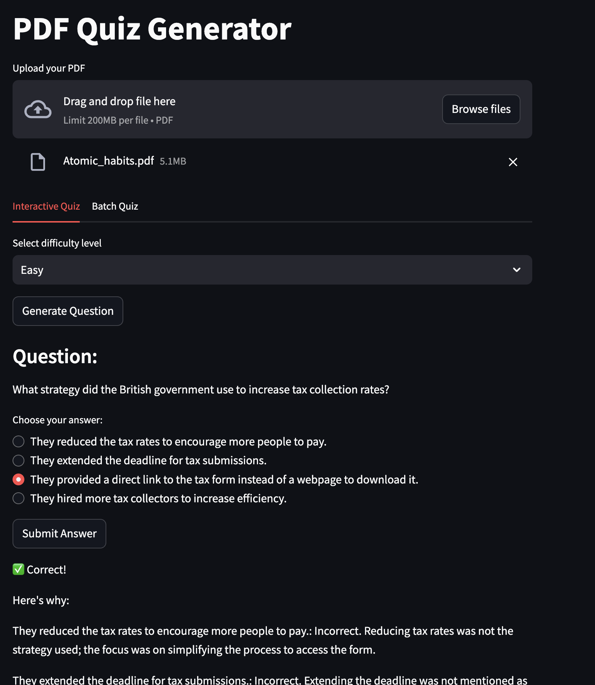

# quiz-gpt
A repo to generate a quiz based on the uploaded material

This repo can be used to generate a quiz based on the uploaded material. It uses the OpenAI API to generate the quiz and the Langchain library to create the vector store. This can be run as a streamlit app or as a command line tool.

## Usage

To use the app or the command line tool, create a conda environment with the dependencies or install the dependencies using [poetry](https://python-poetry.org/docs/).

Clone the repo, install the dependencies by running the following commands:

```bash
git clone git@github.com:suha-mokalla/quiz-gpt.git
cd quiz-gpt
poetry install
```

Then, initialize the environment by running

```bash
poetry shell
```

Note that to run this repo, you need to have an OpenAI API key. You can get one by signing up for an account on the [OpenAI website](https://platform.openai.com/api-keys). Once you have an API key, you can set it in the `./env/.env` file. Content of the file should be as follows:

```
OPENAI_API_KEY=<your-openai-api-key>
```

### Running the app

### Update

The app now has two tabs:

- Interactive mode: This is the default mode where the user can one question at a time and get feedback on their answer.
- Batch mode: This mode allows the user to generate a quiz with a specified number of questions.

To run the app, run the following command:

```bash
streamlit run app.py
```

This will start a local server and open the app in your default web browser. Click on the `Browse files` button to upload a PDF file. Once the file is uploaded, choose the number of questions you want to generate and click on the `Generate Quiz` button to generate the quiz. The quiz will be displayed in the app and is also saved as a text file in the `outputs` directory.




### Running the command line tool

To run the command line tool, run the following command:

```bash
python main.py --pdf_path <path-to-pdf-file> --num_questions <number-of-questions> --mode <interactive|batch>
```
Interactive mode is the default mode. This will generate one question at a time based on the difficulty level selected by the user. The user can then submit their answer and get feedback on their answer. It also provides a score whenever the user submits an answer. The user can quit by typing `q` when prompted.


Batch mode: This will generate a quiz based on the uploaded PDF file and save it as a text file in the `outputs` directory. There is an additional argument `--num_chunks` that specifies the number of chunks to use for the context. This is useful when the PDF file is large and the context is not fully loaded into the memory. The default value is 3.

**ToDo**:
- Error handling for the app to check if the PDF file is valid and if the OpenAI API key is set.
- Make the text box editable in the app.
- Multiple file upload capability - Batch processing.
- Add seed to the quiz generation process to make the quiz more consistent.